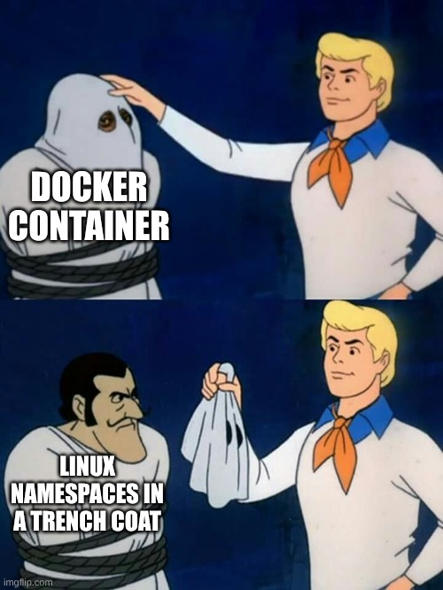

If you use Docker every day, you know the workflow: `docker build`, `docker pull`, `docker run`. But for a Software Engineer, treating Docker as a "black box" that magically spawns mini-computers isn't enough.

A container isn't a virtual machine. There is no hypervisor, no guest kernel, and no hardware emulation. In reality, a container is just a **standard Linux process** that the kernel has isolated using four specific features.

If you stripped away the Docker Engine, you could build a container yourself using nothing but raw Linux syscalls. Here is how that works under the hood.

### 1. Namespaces: The Virtualization of Resources

Namespaces are the core of isolation. While a VM virtualizes hardware, Namespaces virtualize **kernel resources**. When you start a container, the runtime calls `clone()` or `unshare()` with specific flags to create a process with its own private view of the system.

- **PID Namespace:** This creates a nested process tree. The process thinks it is **PID 1 (init)**, but on the host, it's just a high-numbered PID. It cannot see or signal any process outside its own namespace.
- **NET Namespace:** This provides a private network stack. The process gets its own virtual interfaces (`eth0`), loopback device, IP addresses, and routing tables. This is why two containers can both bind to port 80 without a conflict.
- **MNT Namespace:** This isolates mount points. Combined with `pivot_root`, it ensures the process only sees the container's root filesystem. It literally cannot "walk" back into the host's `/etc` or `/home` directories.
- **UTS Namespace:** This isolates the hostname and NIS domain name. It allows the container to have its own identity (e.g., `web-server-01`) on the network, entirely independent of the host's actual name.
- **IPC Namespace:** This isolates Inter-Process Communication resources like System V IPC objects and POSIX message queues. It prevents a process in one container from accessing the shared memory of a process in another.
- **USER Namespace:** This maps user and group IDs. It allows a process to have **root privileges (UID 0)** inside the container while being a completely unprivileged user on the host, significantly reducing the risk of a container breakout.
- **CGROUP Namespace:** This hides the host's cgroup hierarchy. It ensures the process only sees its own relevant cgroup path (usually `/`), preventing it from gaining information about the host's resource configuration.
- **TIME Namespace:** This allows the container to have its own offsets for the system monotonic and boot clocks. This is useful when you need a container to believe the system has been up for years, even if the host just rebooted.

### 2. Control Groups (cgroups): Resource Allocation

If Namespaces provide isolation, **cgroups** provide governance. Without them, a single container with a memory leak could bring down the entire host via the OOM (Out of Memory) Killer.

Cgroups allow the kernel to enforce hard limits on a process group:

- **Memory:** Caps the RAM usage. If a container hits its limit, the kernel kills _only_ that process tree.
- **CPU:** Uses the CFS (Completely Fair Scheduler) to ensure a container only gets its allocated share of CPU cycles.
- **Blkio:** Limits the disk I/O throughput to prevent "noisy neighbors" from starving other infrastructure.

### 3. Union File System (Overlay2): The Storage Layer

Docker images are made of layers. If you have five containers based on `ubuntu:22.04`, you don't have five copies of the Ubuntu OS on your disk. You have one.

Docker uses **Overlay2**, a Union File System that "stacks" directories on top of each other:

- **LowerDir (Read-Only):** The base layers of your image.
- **UpperDir (Writable):** A thin layer created when the container starts. Any changes you make (logs, temp files) go here.
- **Merged:** The unified view the container actually sees.

This uses **Copy-on-Write (CoW)**. If you modify a file in the base image, the kernel copies it to the `UpperDir` first, then applies the change.

### 4. Linux Capabilities: Granular Privilege

Running a process as `root` is traditionally dangerous. However, most containers run as `UID 0`. To prevent a "root" process from compromising the host kernel, Docker uses **Linux Capabilities**.

The kernel breaks down the "all-powerful" root privilege into ~40 distinct bits. Docker starts by **dropping all capabilities** and adding back only a few (about 14 by default), such as `CAP_NET_BIND_SERVICE` (to allow binding to ports < 1024) and `CAP_CHOWN`. It drops `CAP_SYS_ADMIN`, ensuring that even if a container is compromised, the attacker's "root" access is severely restricted.

### The Reality Check: Linking to the Host

To truly understand Docker, you have to realize that the "container" doesn't actually exist as a separate entity. It is just a mapping.

#### PID Mapping

If you run `ps aux` inside an Nginx container, you will see `nginx` running as **PID 1**. But if you run `ps aux | grep nginx` on your **Host OS**, you will see that same process running with a completely different PID, like **4502**.

- The Kernel maintains a translation table.
- To the process, it's the king of its own world (`PID 1`).
- To the Host, it’s just another tenant (`PID 4502`) managed by the same CPU scheduler as your browser or your terminal.

#### Port Mapping

When you run a container with `-p 8080:80`, Docker isn't "bridging" two computers. It is using **iptables** (specifically DNAT rules) on the host.

- When traffic hits the host on port 8080, the Kernel's networking stack sees the rule and reroutes those packets into the container's **NET Namespace**.
- The Nginx process sitting in that namespace sees the traffic arriving on port 80 and responds, never knowing it was actually targeted at 8080 on the outside.

### How it all comes together: `docker run nginx`

To understand the mechanics, let’s trace what happens inside the Kernel when you execute a simple `docker run nginx` command.

1. **Overlay2 Triggered:** The Docker Engine identifies the Nginx image layers. It mounts the `LowerDir` (the Nginx binaries and OS libraries) and creates a fresh `UpperDir`. It merges them into a single view. The process now has a "disk" to boot from.
2. **Namespaces Triggered:** Docker calls `clone()` with flags like `CLONE_NEWPID` and `CLONE_NEWNET`. Suddenly, the Nginx process is born. It looks around and sees it is `PID 1`. It sees a blank network interface waiting for an IP. It is effectively blind to the rest of your server.
3. **Cgroups Triggered:** Before Nginx can start serving requests, Docker writes the PID of this new process into `/sys/fs/cgroup/cpu/docker/<container_id>/cgroup.procs`. If you set a 512MB limit, the Kernel now monitors every byte Nginx allocates.
4. **Capabilities Triggered:** Before the final execution, the runtime applies a "Capability Bounding Set." Even though Nginx is running as root to bind to port 80, the Kernel strips it of the ability to do things like load kernel modules or restart the host.
5. **The Pivot:** Finally, the process calls `pivot_root`, making the Merged OverlayFS directory its new `/`. It then executes the Nginx binary.

**Effectively, a container is not a box; it is a process with boundaries.** Understanding these primitives is what separates a Docker user from a Systems Engineer.
