If you listen to Senior Engineers talk about Concurrency, you’d think it’s the plot of a spy thriller.

_"We have a Race Condition in the kernel! The Deadlock is spreading! If we don't Mutex the shared memory in 10 seconds, the whole heap is going to blow!"_


It sounds terrifying. It sounds complex. It sounds like you need a PhD in Computer Science and a leather trench coat to pull it off.

Just relax. It’s not that deep.

Most of the time, concurrency isn't about disarming nuclear bombs. It’s about teaching your program to do two things at once independently so that you have more time to doom scroll.

Today, we’re going to look at a program demonstrating the simplest use case for Go concurrency.

## Here's the problem

The requirements are simple:

1. Ask a question.
2. Give the user 5 seconds to answer.
3. If they fail, make them feel bad about it.

In a perfect world, I could write this:

```go
start := time.Now()

fmt.Println("5 + 5 = ?")

var answer string

// Step 1: Ask for input
fmt.Scanln(&answer)

// Step 2: Check if time ran out
if time.Since(start) > 5*time.Second {
    fmt.Println("Too slow!")
    os.Exit(1)
}

fmt.Println("Just in time!")

```

It looks logical, right? You ask for input, and then you check the time.

**But here is why this is completely wrong.**

We are using `fmt.Scanln()` (or `fmt.Scan`, or `bufio.Scanner`). In Go, reading from Standard Input is a **Blocking Operation**.

"Blocking" is a nice technical way of saying that your CPU effectively goes on a lunch break.
When the code hits that `fmt.Scanln` line, the program **pauses execution entirely**. It stops. It waits.

It doesn't care that you have a timer logic on the very next line. It doesn't care that the world is burning. It only cares about the `Enter` key.

- **If the user answers in 2 seconds:** The code unpauses, checks the time, and says "Just in time!"
- **If the user answers in 10 years:** The code waits for 10 years, unpauses, and _only then_ notices that 5 seconds have passed.


If I run a timer on the main thread, I can't read input. If I read input, I can't check the timer. **We are stuck**.

## The Solution: Delegating the Wait

To fix this, we need to separate the "waiting" from the "decision making." We effectively have two independent jobs that need to happen at the same time:

1. **The Input Job:** Sitting around waiting for the user to type.
2. **The Timer Job:** Counting down 5 seconds.

This diagram shows exactly how we split the work. Notice how the **Main Thread** doesn't do the heavy lifting anymore; it just sets up the race and waits for the winner.

```mermaid
sequenceDiagram
    participant Main as Main Thread
    participant Timer
    participant Worker as Goroutine

    Note over Main: 1. Setup
    Main->>Timer: Start Timer (5s)
    Main->>Worker: Start "go func()"

    Note over Main, Worker: 2. The Race (Select)

    rect rgb(20, 20, 20)
        Note right of Main: Main Thread is blocked here<br/>waiting for the FIRST signal.
        Timer-->>Main: DING! (Wins the race)
    end

    Note over Main: 3. Resolution
    Main->>Main: Print "Too Slow" & Exit

    Note right of Worker: (Dies silently)
```



### What is a Goroutine?

If you are coming from other languages like Java or C++, you might be scared of "Threads." They are heavy, expensive, and hard to manage.

**Goroutines are different.**

Think of a Goroutine as a **function that doesn't block**.
Normally, when you call a function `doWork()`, your program freezes on that line until `doWork` is completely finished.

When you put the keyword `go` in front of it (`go doWork()`), you are telling the runtime:
_"Start this function in the background, but **don't wait for it**. Keep moving to the next line of code immediately."_

They are incredibly cheap (they start at ~2KB of memory), so don't feel bad about spawning one just to wait for a single user input.

In Go, the tool we use to coordinate this race is the `select` statement.

### Let's see how the code looks like now

Here is how we wire it up. We put the boring, blocking work into the background so the main thread stays free to make decisions.

```go
func main() {
    fmt.Println("5 + 5 = ?")

    timer := time.NewTimer(5 * time.Second)

    inputCh := make(chan string)
    scanner := bufio.NewScanner(os.Stdin)

    go func() {
        scanner.Scan()
        inputCh <- scanner.Text()
    }()

    select {
    case <-timer.C:
        fmt.Println("\nTime's up! You were too slow.")
        return

    case answer := <-inputCh:
        fmt.Printf("You answered: %s\n", answer)
    }
}
```

Imagine this as a race. So, we need to set up the players, the track, and the finish line.

### 1. The Time Limit

```go
timer := time.NewTimer(5 * time.Second)

```

This is our deadline. `time.NewTimer` creates a clock that runs in the background. It has a channel inside it (`timer.C`) that will send a signal exactly once after 5 seconds. This is **Player 1** in our race.

### 2. The Channels

```go
inputCh := make(chan string)
scanner := bufio.NewScanner(os.Stdin)

```

We need a way to get the data _out_ of the background thread and back to the main thread.

- **`scanner`**: The tool that actually reads the keyboard.
- **`inputCh`**: The pipe (channel). Think of this as a phone line. The background worker will yell the answer into this end, and we will listen on the other end.

### 3. The Goroutine

```go
go func() {
    scanner.Scan() // <--- BLOCKS HERE
    inputCh <- scanner.Text()
}()

```

This is the most important part.

- **`go func() {...}`**: This spins up a lightweight thread (Goroutine).
- **`scanner.Scan()`**: This line **blocks**. It freezes this specific Goroutine until the user types something.
- **CRITICAL**: Because this is wrapped in `go`, **it does not block the main program**. The main thread effectively skips over this block instantly and moves to the next lines.
- Once the user finally types something, this worker wakes up and puts it into the `inputCh` pipe. This is **Player 2**.

### 4. The Referee

```go
select {
case <-timer.C:
    fmt.Println("\nTime's up! You were too slow.")
    return

case answer := <-inputCh:
    fmt.Printf("You answered: %s\n", answer)
}

```

The `select` statement waits. It stops execution until **one** of its cases is ready to run.

- **If `timer.C` sends a signal first:** It means 5 seconds passed. We print "Time's up" and kill the program.
- **If `inputCh` sends a signal first:** It means the user typed something. We grab the answer and print it.

It doesn't matter which one happens. It only cares about **who is first**. The loser of the race is ignored.

## The "Zombie" Goroutine (A warning)

There is one small catch with this implementation.

If the Timer wins, the `main` function returns and the program exits.
But for that split second before the process dies, that background Goroutine is technically a **Zombie**. It is still sitting there, blocked, waiting for input that will never arrive.

- In a simple CLI tool? **Who cares.** The OS cleans up the mess when the process dies.
- In a long-running backend server? **This is a memory leak.** You just created a ghost in the machine that will haunt your heap forever.

To fix this properly, you would need to use `context.Context` to manage the cancellation, but let’s save that headache for another post.

## Wrapping Up

Concurrency feels like dark magic until you actually write it. You aren't casting spells; you are just managing resources. You have a communication line (channel), a dedicated worker (goroutine), and a hard deadline (timer). That's it.

Go makes this pattern shockingly easy, but reading about it won't make it click. You have to break it yourself.

So go ahead, try it on your own and see what happens. Push the memory leak to production. Live life on edge. Cheers!
